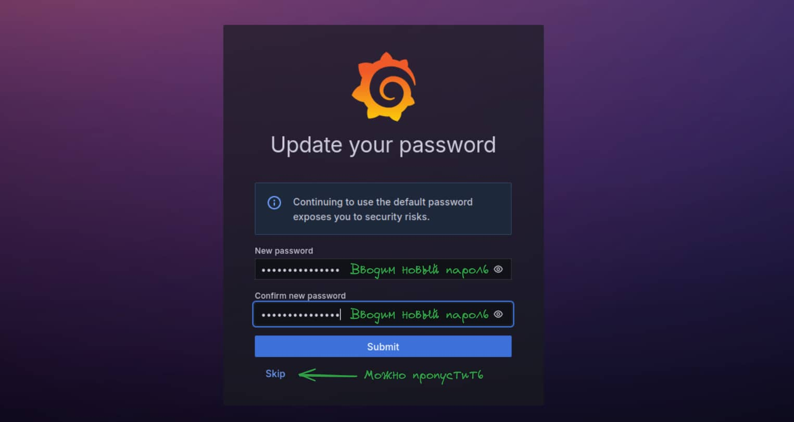
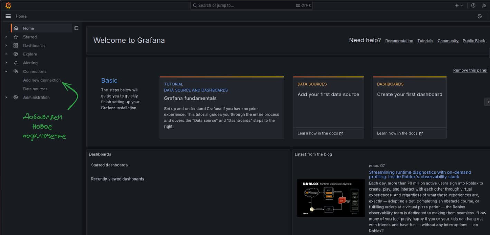

# monGorilla

  
&nbsp;&nbsp;&nbsp;&nbsp;&nbsp;&nbsp;&nbsp;&nbsp;&nbsp;&nbsp;&nbsp;&nbsp;&nbsp;&nbsp;&nbsp;&nbsp;&nbsp;&nbsp;&nbsp;&nbsp;&nbsp;&nbsp;&nbsp;&nbsp;&nbsp;&nbsp;&nbsp;&nbsp;&nbsp;&nbsp;&nbsp;&nbsp;&nbsp;&nbsp;&nbsp;&nbsp;&nbsp;&nbsp;&nbsp;&nbsp;&nbsp;&nbsp;&nbsp;&nbsp;&nbsp;&nbsp;&nbsp;&nbsp;&nbsp;&nbsp;&nbsp;&nbsp;&nbsp;&nbsp;&nbsp;&nbsp;&nbsp;


[](https://opensource.org/licenses/MIT)

  

## 📋 Table of Contents

1. 🌀 [Описание проекта](#what-is-this)
2. 📈 [Краткая документация API](#api_docs)
3. 💾 [База данных](#database_scheme)
4. 🚀 [Инструкция по установке](#installation)
5. ©️ [License](#license)

  

## <a name="what-is-this"> 🌀 Описание проекта</a>

monGorilla - готовая основа для быстрой сборки backend-сервисов на основе `Gorilla Mux`, База данных - `Mongo`. Интерфейс Базы данных - `GORM`. Интерфейс API `Swagger`. Мониторинг - `Prometheus`. Метрики хоста - `Node Exporter`. Визуализация - `Grafana`. Сборка - `Docker Compose`.

## <a name="api_docs"> 📈 Краткая документация API</a>

Работа с моделями осуществляется по следующим эндпоинтам:


| HTTP Method  | HTTP request            | Description                                                    |
| :----------: | :---------------------- | :------------------------------------------------------------- |
|  [**POST**]  | /api/users/register     | Регистрация нового пользователя                                |
|  [**POST**]  | /api/users/login        | Авторизация пользователя про e-mail и паролю                   |
|  [**GET**]   | /api/users/current_user | Извлечение авторизованного пользователя по токену              |
|  [**GET**]   | /api/recipes            | Извлечь все рецепты авторизованного пользователя               |
|  [**POST**]  | /api/recipes            | Создать новый рецепт (только для авторизованного пользователя) |
|  [**GET**]   | /api/recipes/{id}       | Извлечь рецепт по ID                                           |
|  [**PUT**]   | /api/recipes/{id}       | Обновить рецепт по ID (только для авторов)                     |
| [**DELETE**] | /api/recipes/{id}       | Удалить рецепт по ID (только для авторов)                      |


## <a name="database_scheme"> 💾 База данных </a>

  

База данных содержит 2 модели:
    - **Пользователь** (User)
    - **Рецепт** (Recipe)


  
  <details>
<summary>ДЕТАЛЬНАЯ ИНФОРМАЦИЯ О МОДЕЛЯХ </summary>

1. Пользователь (User)
```go
type UserModel struct {
	Id          primitive.ObjectID `json:"id,omitempty"`            
	Password    string             `json:"password,omitempty"`      //Пароль
	FirstName   string             `json:"first_name,omitempty"`    //Имя
	LastName    string             `json:"last_name,omitempty"`     //Фамилия
	PhoneNumber string             `json:"phone_number,omitempty"`  //Номер телефона
	Email       string             `json:"email,omitempty"`         //Email
}
```

2. Рецепт (Recipe)
```go
// Represents user Recipe
type RecipeModel struct {
	Id          primitive.ObjectID `json:"id,omitempty"`
	Title       string             `json:"title,omitempty"`         //Название рецепта
	Stages      []StageModel       `json:"stages,omitempty"`        //Список шагов изготовления
	AuthorEmail string             `json:"author_email,omitempty"`  //Email автора рецепта
}

// Represents user model
type StageModel struct {
	Title       string            `json:"title,omitempty"`          //Название шага
	Description string            `json:"description,omitempty"`    //Описание шага
	Ingredients []IngredientModel `json:"ingredients,omitempty"`    //Список ингредиентов
}

// Represents user model
type IngredientModel struct {
	Subject   string `json:"subject,omitempty"`                     //Название ингридиента
	Condition string `json:"condition,omitempty"`                   //Условие, количество, вес и др
}
```

</details>
  

## <a name="installation"> 🚀 Установка и использование</a>

  

1. ### Подготовка проекта

  

1.1 Клонируете репозиторий

```sh

git clone https://github.com/XanderMoroz/monGorilla.git

```

1.2 В корневой папки создаете файл .env

1.3 Заполняете файл .env по следующему шаблону:

```sh

################################################################################
# APP Config
# Automatically setup app variables
################################################################################
APP_ENV="DEV"
APP_PORT=":8080"
SERVER_ADDRESS=""
ACCESS_TOKEN_SECRET="nduenvrvneu8957hhoiif932ejcp92nf9ne7h3p2982jijpkm2[jw[8h"
ACCESS_TOKEN_EXPIRY_HOUR=1
################################################################################
# MONGO Config
# Automatically create database and user
################################################################################
MONGO_DB_DRIVER="mongodb"
MONGO_ROOT_USERNAME="xander"
MONGO_ROOT_PASSWORD="rndm-pass"
MONGO_DB_NAME="mongorilla"
MONGO_DB_PORT="27017"
# MONGO_DB_HOST="127.0.0.1"   # Без docker 
MONGO_DB_HOST="mongo"       # С docker
################################################################################
# MONGO_EXPRESS Config
# Automatically create database client credentials
################################################################################
MONGO_EXPRESS_USERNAME="admin"
MONGO_EXPRESS_PASSWORD="rndm-pass"
MONGO_EXPRESS_SERVER="mongodb"


```

2. ### Запуск проекта с Docker compose

2.1 Создаете и запускаете контейнер через терминал:

```sh

sudo docker-compose up --build

```

2.3 Сервисы доступны для эксплуатации:

- Fiber APP: http://127.0.0.1:8080/
- Swagger: http://127.0.0.1:8080/swagger/index.html
- Mongo-Express: http://127.0.0.1:8081
- Prometheus: http://127.0.0.1:9090
- Grafana: http://127.0.0.1:3000


3. ### Дополнительные настройки 

<details>
<summary>Как получить доступ к БД через Mongo-Express? </summary>

1. Заходим в браузер по адресу Mongo-Express и вводим данные по умолчанию:

```bash
MONGO_EXPRESS_USERNAME=admin
MONGO_EXPRESS_PASSWORD=pass
```
Картинка
  

</details>
<details>
<summary>Как подключить Grafana к Prometheus? </summary>


1. Заходим в браузер по адресу http://127.0.0.1:3000 и вводим данные по умолчанию:

  - Email or username: admin
  - Password: admin


2. После система потребует придумать новый пароль (это необязательно).



3. Мы авторизованы в сервисе Grafana. Добавим новое подключение...



4. Ищем в списке Prometheus и кликаем по нему


5. Теперь его нужно настроить


7. Извлекаем адрес хоста, на котором расположился Prometheus

```bash
sudo docker inspect prometheus | grep IPAddress
```


8. Заполняем Адрес сервера Prometheus данными хоста 


9. Готово

</details>


<details>
<summary>Как сделать авто-генерацию документации Swagger? </summary>

1. Устанавливаете swag

```sh
go get github.com/swaggo/swag/cmd/swag
```

3.2 Устанавливаете GOPATH

```sh
export PATH=$PATH:$(go env GOPATH)/bin
```

3.3 Генерируете новый вариант документации

```bash
swag init
```
</details>


## <a name="license"> ©️ License
